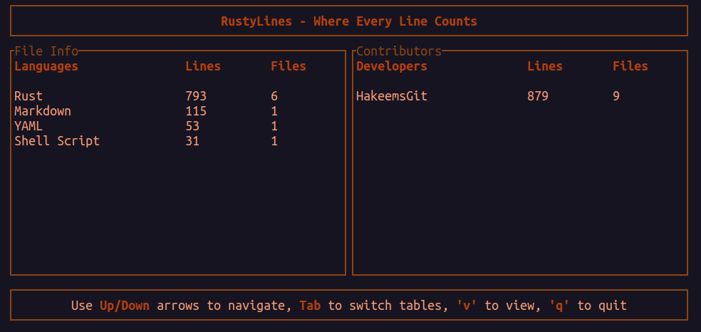

# RustyLines

RustyLines is a cross-platform command-line tool that scans a specified directory, counts lines of code, and displays statistics categorized by programming language and contributors in an interactive Terminal User Interface (TUI). 

## Display

The TUI consists of:

- **Title Bar:** Displays the application name.
- **Main Tables:**
  - **File Info:** Lists programming languages with lines of code and file counts.
  - **Contributors:** Lists contributors with lines of code and file counts.
- **Help Section:** Displays navigation instructions.
- **Detailed View:** Shows more information about the selected item when toggled.



## Features

- **Recursive Directory Scanning:** Analyzes all files within a directory and its subdirectories.
- **Language Statistics:** Counts lines of code and files for each programming language, including support for multi-word language names.
- **Contributor Statistics:** Uses Git information to attribute lines of code to different contributors.
- **Interactive TUI:** Displays results in a TUI with two main sections:
  - **File Info:** Shows statistics for each programming language.
  - **Contributors:** Shows statistics for each contributor.
- **Navigation:**
  - **Up/Down Arrows:** Navigate within the focused table.
  - **Tab:** Switch focus between tables.
  - **v Key:** Toggle detailed view of the selected item.
  - **q Key:** Quit the application.
- **Cross-Platform Support:** Works on Linux, macOS, and Windows.

## Installation

### Prerequisites

- **Rust Toolchain:** Ensure you have Rust installed. If not, download it from [rust-lang.org](https://www.rust-lang.org/).
- **Git:** Required for retrieving contributor information.

### Building from Source

1. **Clone the Repository:**

    ```bash
    git clone https://github.com/HakeemsGit/RustyLines.git
    ```

2. **Navigate to the Project Directory:**

    ```bash
    cd RustyLines
    ```

3. **Build the Application:**

    ```bash
    cargo build --release
    ```

    This will create an executable in the `target/release` directory.

## Usage

### Running the Application

To run RustyLines, execute the binary and provide the path to the directory you want to analyze:

- **On Linux and macOS:**

    ```bash
    ./target/release/RustyLines /path/to/your/project
    ```

- **On Windows:**

    ```powershell
    .\target\release\RustyLines.exe C:\path\to\your\project
    ```

Replace `/path/to/your/project` or `C:\path\to\your\project` with the actual path to the directory you want to analyze.

### Navigating the TUI

- **Up/Down Arrows:** Navigate within the focused table.
- **Tab:** Switch focus between the File Info and Contributors tables.
- **v Key:** Toggle between the main view and a detailed view of the selected item.
- **q Key:** Quit the application.

### Example

```bash
./target/release/RustyLines ~/Projects/MyRepo
```

## Platform-Specific Instructions

### Linux and macOS

Ensure that the executable has the necessary permissions:

```bash
chmod +x ./target/release/RustyLines
```

## Notes
**Permissions**: Ensure you have the necessary permissions to read the files in the directory you're analyzing.

**Terminal Size**: For optimal display, use a terminal window that is at least 80 columns wide and 24 rows tall.

**Git Repositories**: For contributor statistics, the target directory should be a Git repository.

**Contributing**: Contributions are welcome! Please submit a pull request or open an issue to discuss changes.

## License
This project is licensed under the MIT License.
